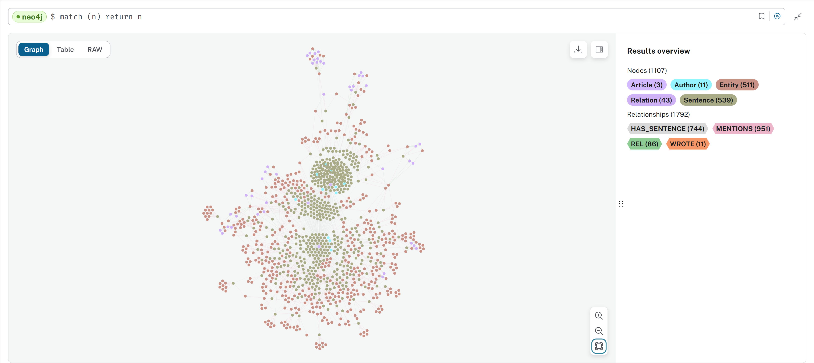

# Projet Open Data Science
Bien que non évalué, nous avons souhaité intégrer un repo ou tous le code que nous avons fait dans le cadre de ce cas pratique est répértorié. 

Le but de ce cas pratique a été de mettre un place un code permettant la création d'un graph Neo4J basé sur des PDF de recherche médicales. Nous avons utilisé [BERN2](http://bern2.korea.ac.kr/) pour la recherche d'entités médicales et [Chebi](https://www.ebi.ac.uk/chebi/init.do) pour l'augmentation de données. 

Voici le résultat obtenu dans son état global après l'intégration de deux documents : 

## Disclaimer :
Je (Briefgarde) n'ai pas fait tout le code ici. [Froma91](https://github.com/Froma91) a fait le code de `Project_ODS.ipynb` ainsi que `authors.html`, et le code de `FirstGuidedAttempt` a été, en grande partie, guidé par le code offert par le professeur. Nous n'avons écrit aucun des PDFs. 